Las Vegas Restaurants
================
Claire Wang
2018-05-20

``` r
# Libraries
library(tidyverse)

# Files
file_yelp <-
  "C:/Users/Claire/Downloads/yelp_business.csv"
```

Every year, Yelp releases a public dataset of local businesses for
students to explore and use in innovative research. The data includes
information on businesses, ratings, and reviews. More information on
Yelp’s data and student challenge can be found
[here](https://www.yelp.com/dataset/challenge). Since the data changes
each year, please download the 2017 dataset on [Box](URL).

For this challenge you will explore businesses in Las Vegas, focusing on
restaurants and food-related businesses (e.g. bakeries, grocery stores,
etc.), and create maps of these restaurants, by rating.

## Detailed data

### Download raw data

Download the raw data from [Box](https://www.yelp.com/dataset/download).
The raw detailed data in csv format. We are interested in
`yelp_business.csv`. Read in the csv file as a data frame, then use
`glimpse` or `summary` to explore the dataset.

``` r
# solution-begin

df <-
  file_yelp %>%
  read_csv()
```

    ## Parsed with column specification:
    ## cols(
    ##   business_id = col_character(),
    ##   name = col_character(),
    ##   neighborhood = col_character(),
    ##   address = col_character(),
    ##   city = col_character(),
    ##   state = col_character(),
    ##   postal_code = col_character(),
    ##   latitude = col_double(),
    ##   longitude = col_double(),
    ##   stars = col_double(),
    ##   review_count = col_integer(),
    ##   is_open = col_integer(),
    ##   categories = col_character()
    ## )

``` r
# solution-end
```

### Clean data for analysis

**q1.0** Is this data exclusively for businesses in the U.S., or does it
include other countries? Create a dataframe `q1` that only contains
businesses in the U.S.A. (Hint: filter out certain `state` and
`postal_code` values.)

``` r
# solution-begin

q1 <-
  df %>%
  filter(
    !state %in% c("6", "30", "3", "01"),
    str_length(state) == 2,
    str_length(postal_code) == 5
  ) 
# solution-end
```

<!-- solution-begin -->

Exploring the data, we saw that there are states that are numerically
coded, so we removed states with the numbers 6, 30, 3, and 01 as values.
We also filtered out any states with more or less than 2 letters in the
code. We also removed postal codes with more or less than 5 digits.
<!-- solution-end -->

**q1.1** Are the states well-represented in this dataset, or is the data
concentrated in certain states? To answer this, print out the top 5
states with the most businesses in this dataset.

``` r
# solution-begin

q1 %>%
  count(state) %>%
  select(state, n_biz = n) %>%
  arrange(desc(n_biz)) %>%
  top_n(n = 5)
```

    ## Selecting by n_biz

    ## # A tibble: 5 x 2
    ##   state n_biz
    ##   <chr> <int>
    ## 1 AZ    52027
    ## 2 NV    32950
    ## 3 NC    12914
    ## 4 OH    12591
    ## 5 PA    10091

``` r
# solution-end
```

<!-- solution-begin -->

Arizona has the most observations, with more than 52,000 businesses.
Nevada is second, with just under 33,000. North Carolina, Ohio, and
Pennsylvania are the next three most represented states.  
<!-- solution-end -->

**q1.2** From Q1.1, we saw that Arizona and Nevada have the most
businesses. We will focus on businesses in Nevada - specifically,
businesses in Las Vegas. Create a new dataset, `q1.2`, that only
includes businesses in Las Vegas.

``` r
# solution-begin
q1.2 <-
  q1 %>%
  filter(city == "Las Vegas")
# solution-end
```

## Create restaurant data

**q2.0** We are interested in creating a restaurant map, so we want to
filter out our data further to only include food-related businesses.

Using `q1.2`, create a new dataframe `q2` that only contains businesses
whose category includes the string “Restaurants” or “Food”.

``` r
# solution-begin
q2 <-
  q1.2 %>%
  filter(
    str_detect(categories, "Restaurants|Food")
  )
# solution-end
```

**q2.1** You may have noticed that each restaurant’s `categories`
include multiple values. For example, a restaurant’s category might be
“Restaurants, American, Burgers, Fast Food”. We want to have only one
label per restaurant.

This process is a bit subjective, but for the purposes of this challenge
we will do the following. Using `q2`, create a dataframe `q2.1` using
the following steps:

  - Use the function `separate_rows()` to create a new observation for
    each label in `categories` for each restaurant. You may want to
    define the `sep =` parameter.
  - Since we have multiple observations now for the same business,
    create a new variable called `row_num` that sequentially numbers the
    rows for each business. `row_num` should start over at 1 for each
    new business. We will use this variable later to ensure we end up
    with one observation per restaurant.
  - All food-related businesses have generic values in their
    `categories`, such as “Food” or “Restaurants”. We do **not** want
    these generic labels as our category; instead, we are interested in
    specific `categories` labels, such as “Mexican” or “Bakeries”. To
    solve this, remove any observations whose `categories` value is in
    the `generic_food_labels` vector defined below.
  - Now, to get one observation per business, keep only the minimum
    row\_num for each business (`row_num == min(row_num)`).

<!-- end list -->

``` r
generic_food_labels <- 
  c(
    "Restaurants", 
    "Food", 
    "Food Trucks", 
    "Food Delivery Services",
    "Food Stands", 
    "Event Planning & Services", 
    "Food Court", 
    "Caterers",
    "Shopping",
    "Arts & Entertainment",
    "Car Wash",
    "Gas Stations",
    "Automotive",
    "Local Flavor",
    "Bookstores",
    "Nightlife",
    "Venues & Event Spaces",
    "Business Consulting",
    "Hotels & Travel",
    "Social Clubs",
    "Party & Event Planning",
    "Food Tours"
  )

# solution-begin
q2.1 <-
  q2 %>%
  separate_rows(categories, sep = ";") %>%
  group_by(business_id) %>%
  mutate(row_num = row_number()) %>%
  filter(!categories %in% generic_food_labels) %>%
  filter(row_num == min(row_num)) %>%
  ungroup()
# solution-end
```

## Restaurant EDA

Now we have a clean dataset of Las Vegas restaurants (q2.1) that we can
explore.

**q3.0** Is a restaurant’s rating related to its number of reviews?
Create a visualization that answers this question and interpret.

``` r
# solution-begin
q2.1 %>%
  ggplot(mapping = aes(x = stars, y = review_count)) +
  geom_point() +
  geom_smooth(method = "loess") +
  labs(
    title = "Restaurant Ratings by Review Count",
    subtitle = "Restaurants have higher review counts as their rating goes up, up to 4 stars",
    x = "Restaurant Average Rating",
    y = "Number of Reviews"
  )
```

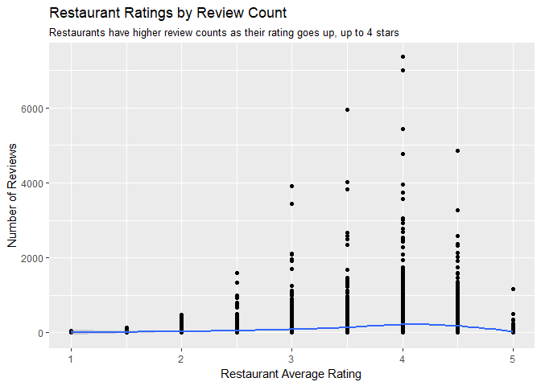

``` r
# solution-end
```

<!-- solution-begin -->

Restaurants with higher average ratings have higher review counts until
4 stars. After 4 stars, the number of reviews decreases as rating
increases. It could be that most users rate 3.5-4 stars and are less
hesitant to give a restaurant a 1, 2, or 5 star rating.  
<!-- solution-end -->

**q3.1** Create a vector called `top_15_categ` that includes the top 15
most common restaurant types in Las Vegas. What are the top 5 most
common types of restaurants in Las Vegas?

``` r
# solution-begin
top_15_categ <-
  q2.1 %>%
  count(categories, sort = TRUE) %>%
  top_n(n = 15) %>%
  pull(categories)
```

    ## Selecting by n

``` r
top_15_categ[1:5]
```

    ## [1] "Mexican"                "Fast Food"             
    ## [3] "Pizza"                  "American (Traditional)"
    ## [5] "Coffee & Tea"

``` r
# solution-end
```

**q3.2** Of these top 15 most popular restaurant types, which types have
the highest average rating? Create a visualization that answers this
question, ordering them by average rating, and interpret.

``` r
# solution-begin

q2.1 %>%
  filter(categories %in% top_15_categ) %>%
  ggplot(
    mapping = aes(
      x = stars,
      y = reorder(categories, stars, FUN = mean), 
    )
  ) +
  geom_bin2d() +
  labs(
    title = "Ratings by Restaurant Type",
    subtitle = 
      "Bakeries have the highest ratings, fast food the worst",
    x = "Restaurant Type",
    y = "Average Ratings",
    caption = "Source: Yelp"
  ) +
  theme(axis.text.x = element_text(angle = 45, vjust = 1, hjust = 1))
```

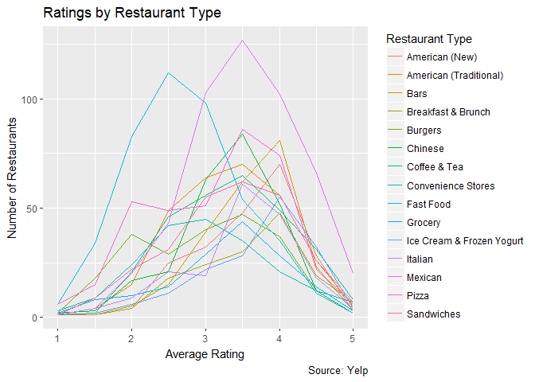

``` r
# solution-end
```

<!-- solution-begin -->

Fast food and burgers tend to have lower restaurant ratings. Bakeries,
breakfast, and coffee places/cafes have the highest. However, given that
the range of rating values is so small, the boxplots are quite close to
each other. <!-- solution-end -->

**q3.3** Create a visualization of your own to uncover a new insight
about restaurants in Las Vegas.

## Creating a Restaurant Map

Our Yelp data uses latitude and longitude to identify a business’s
location. We will use two R libraries, `ggmap` and `mapproj`, to create
our maps, as they use latitude and longitude data.

``` r
library(ggmap)
library(mapproj)
```

    ## Loading required package: maps

    ## 
    ## Attaching package: 'maps'

    ## The following object is masked from 'package:purrr':
    ## 
    ##     map

**q4.0** `ggmap` has pre-created maps that we can load and use. Create a
variable `lv_map` that is a map of Las Vegas (Hint: use `get_map()`,
specifying `location` as Las Vegas). To view the map, use
`ggmap(lv_map)`.

``` r
# solution-begin

lv_map <- 
  get_map(
    location = 'Las Vegas',
    zoom = 12
  )
```

    ## Map from URL : http://maps.googleapis.com/maps/api/staticmap?center=Las+Vegas&zoom=12&size=640x640&scale=2&maptype=terrain&language=en-EN&sensor=false

    ## Information from URL : http://maps.googleapis.com/maps/api/geocode/json?address=Las%20Vegas&sensor=false

``` r
# solution-end

ggmap(lv_map)
```

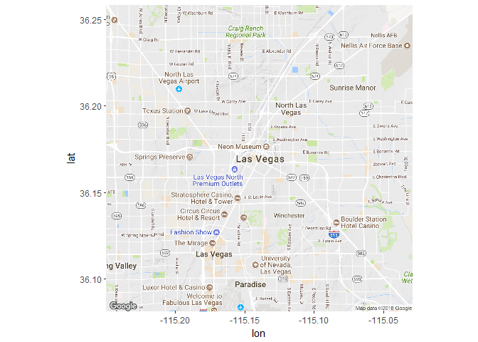

**q4.1** We can plot our restaurant data directly on the map of Las
Vegas by using `ggmap(lv_map) + geom_point(...)`. Create a dataframe
`q4.1` that only consists of Las Vegas “Burgers” restaurants. Plot the
points of `q4.1` over the map of Las Vegas, `lv_map`.

``` r
# solution-begin

q4.1 <-
  q2.1 %>%
  filter(categories == "Burgers")

map_output <-
  ggmap(lv_map) +
  geom_point(
    data = q4.1,
    aes(
      x = longitude,
      y = latitude,
      color = factor(format(round(stars, 1), nsmall = 1))
    ),
    alpha = 0.7
  ) +
  labs(
    title = "Burgers Food Map",
    x = NULL,
    y = NULL,
    caption = "Source: Yelp",
    color = "Business Rating"
  )

map_output
```

    ## Warning: Removed 74 rows containing missing values (geom_point).

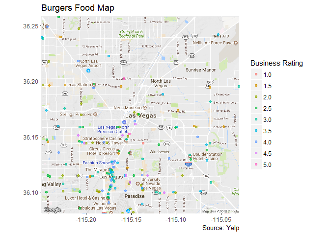

``` r
# solution-end
```

## Generalizing the Restaurant Map

We were able to create a map for Burgers, but suppose we want to create
restaurant maps for the 15 most popular (populous) restaurant types that
we identified in `top_15_categ`.

**q5.0** First, create a function that, given an input for a particular
cuisine type, will create a food map of Las Vegas restaurants with that
cuisine, colored by rating. The function should also print the map.

``` r
# solution-begin

# Create function
create_food_map <- function(x) {
  # Filter dataset based on x cuisine
  df_cuisine <-
    q2.1 %>%
    filter(categories == x)
  
  # Create map
  map_output <-
    ggmap(lv_map) +
    geom_point(
      data = df_cuisine,
      aes(
        x = longitude,
        y = latitude,
        color = factor(format(round(stars, 1), nsmall = 1))
      ),
      alpha = 0.7
    ) +
    labs(
      title = "Las Vegas Restaurant Map",
      subtitle = str_c("Category: ", df_cuisine$categories),
      x = NULL,
      y = NULL,
      caption = "Source: Yelp",
      color = "Business Rating"
    )
  
  print(map_output)
}

# solution-end
```

**q5.1** Using `walk()` and `top_15_categ`, write one line of code that
will print a map for each of the top 15 categories of restaurants in Las
Vegas.

``` r
# solution-begin
walk(top_15_categ, create_food_map)
```

    ## Warning: Removed 155 rows containing missing values (geom_point).

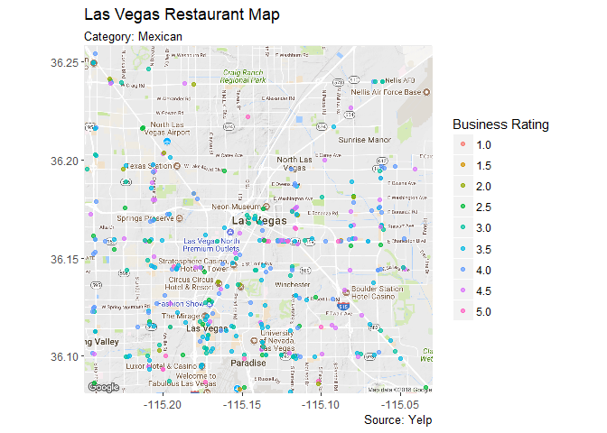

    ## Warning: Removed 162 rows containing missing values (geom_point).

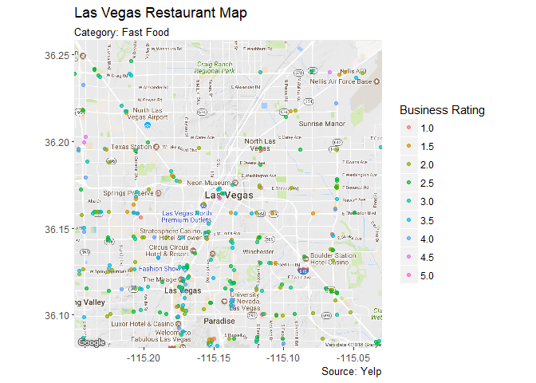

    ## Warning: Removed 155 rows containing missing values (geom_point).

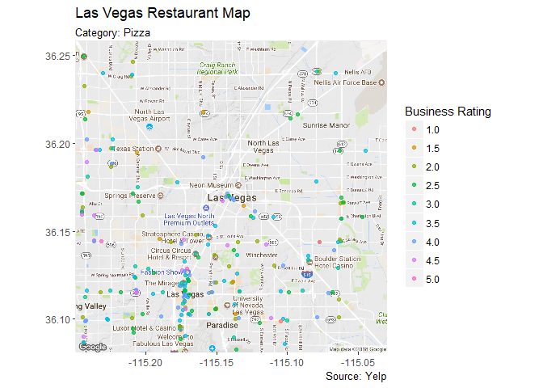

    ## Warning: Removed 102 rows containing missing values (geom_point).

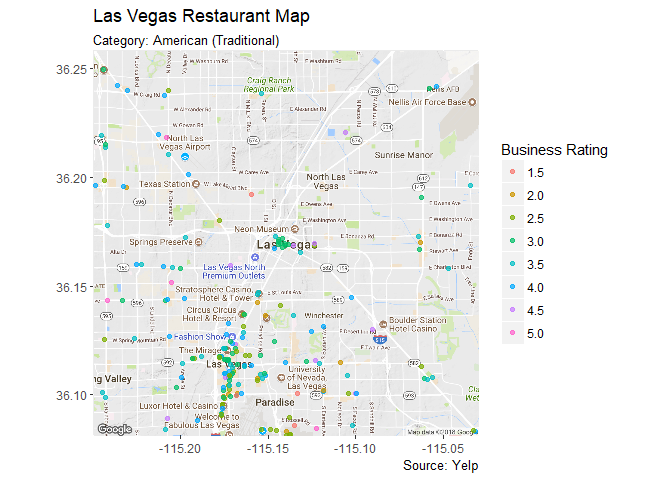

    ## Warning: Removed 111 rows containing missing values (geom_point).

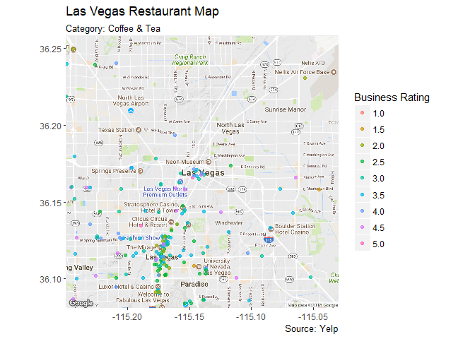

    ## Warning: Removed 103 rows containing missing values (geom_point).

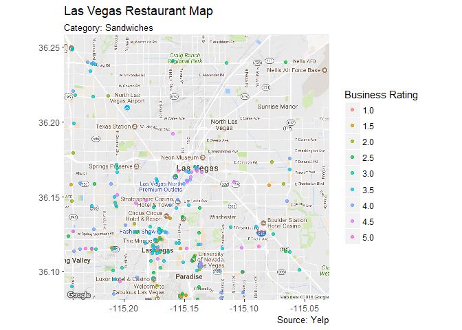

    ## Warning: Removed 71 rows containing missing values (geom_point).

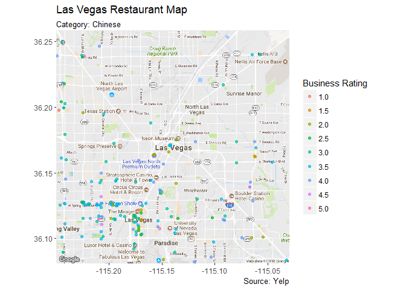

    ## Warning: Removed 69 rows containing missing values (geom_point).

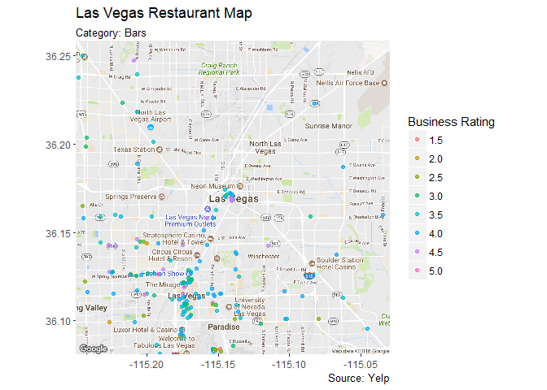

    ## Warning: Removed 74 rows containing missing values (geom_point).

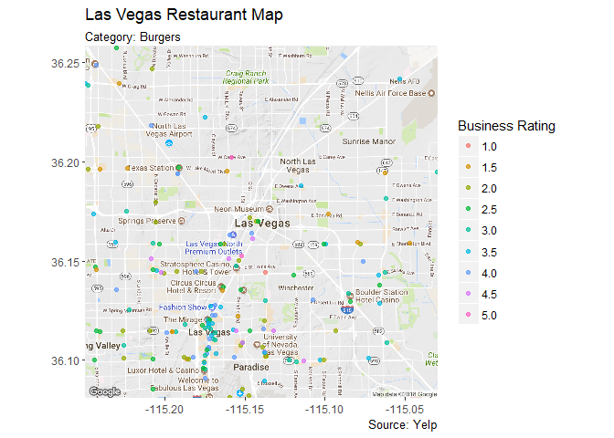

    ## Warning: Removed 69 rows containing missing values (geom_point).

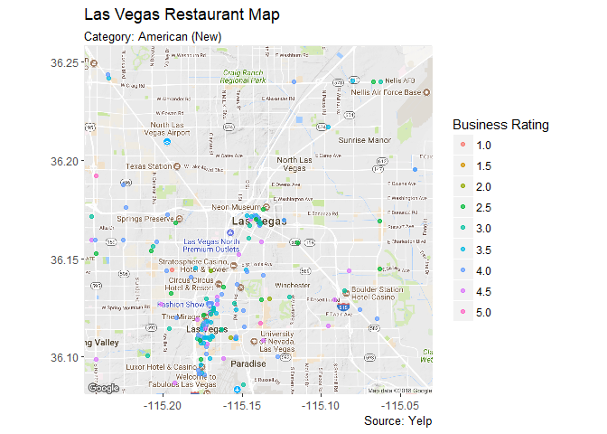

    ## Warning: Removed 105 rows containing missing values (geom_point).

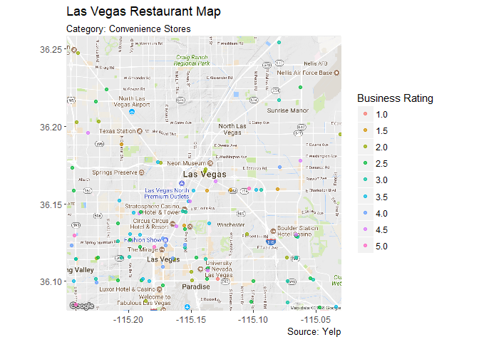

    ## Warning: Removed 70 rows containing missing values (geom_point).

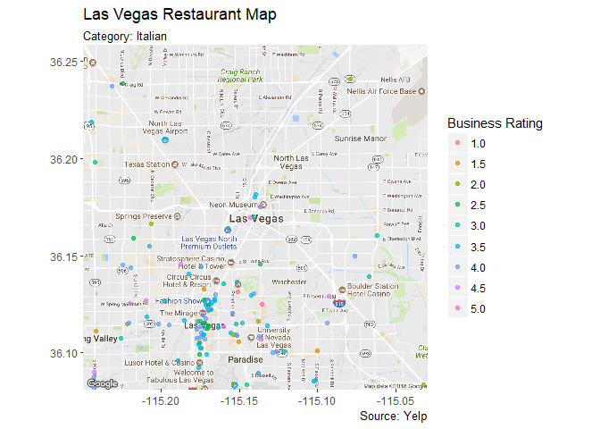

    ## Warning: Removed 73 rows containing missing values (geom_point).

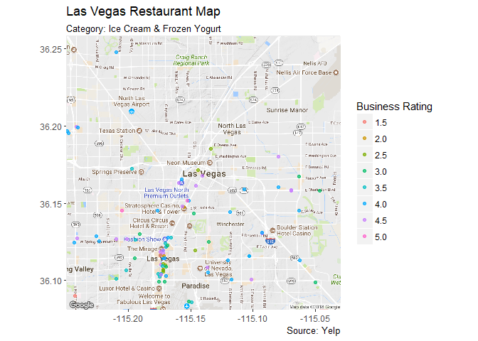

    ## Warning: Removed 57 rows containing missing values (geom_point).

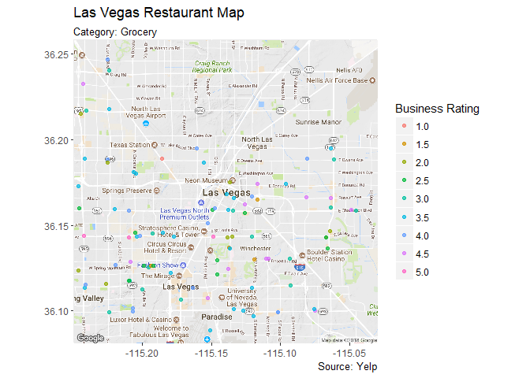

    ## Warning: Removed 65 rows containing missing values (geom_point).

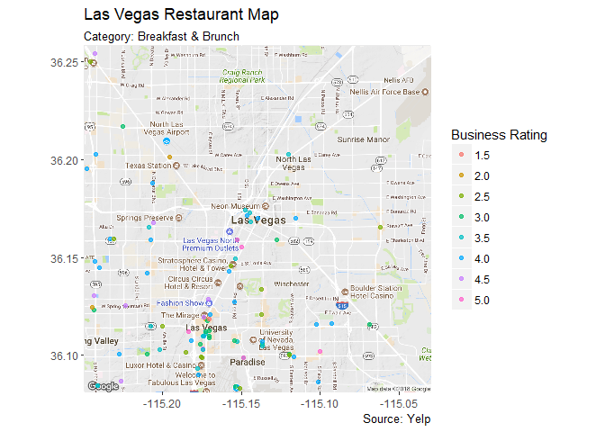

``` r
# solution-end
```
