Las Vegas Restaurants
================
Claire Wang
2018-05-20

``` r
# Libraries
library(tidyverse)
library(ggmap)
library(mapproj)

# Files
file_yelp <- "C:/Users/Claire/Downloads/yelp_business.csv"
```

Every year, Yelp releases a public dataset of local businesses for
students to explore and use in innovative research. The data includes
information on businesses, ratings, and reviews. More information on
Yelp’s data and student challenge can be found
[here](https://www.yelp.com/dataset/challenge). Since the data changes
each year, please download the 2017 dataset on
[Box](https://stanford.box.com/s/eijybzf2mhbfrahlxlfauenxb4rgiwu0).

For this challenge you will explore businesses in Las Vegas, focusing on
restaurants and food-related businesses (e.g. bakeries, grocery stores,
etc.). You will do some preliminary EDA, then finish by creating
restaurant maps for Las Vegas (by cuisine type) and ultimately
automating this map-making process.

## Detailed data

### Download raw data

Download the raw data from
[Box](https://stanford.box.com/s/eijybzf2mhbfrahlxlfauenxb4rgiwu0). Read
in the csv file as a data frame, then use `glimpse` or `summary` to
preview the data.

``` r
df <-
  file_yelp %>%
  read_csv()
```

    ## Parsed with column specification:
    ## cols(
    ##   business_id = col_character(),
    ##   name = col_character(),
    ##   neighborhood = col_character(),
    ##   address = col_character(),
    ##   city = col_character(),
    ##   state = col_character(),
    ##   postal_code = col_character(),
    ##   latitude = col_double(),
    ##   longitude = col_double(),
    ##   stars = col_double(),
    ##   review_count = col_integer(),
    ##   is_open = col_integer(),
    ##   categories = col_character()
    ## )

### Clean data for analysis

**q1.0** Is this data exclusively for businesses in the U.S., or does it
include other countries? Create a dataframe `q1` that only contains
businesses in the U.S. (Hint: use variables `state` and `postal_code`.)

``` r
q1 <-
  df %>%
  filter(
    !state %in% c("6", "30", "3", "01"),
    str_length(state) == 2,
    str_length(postal_code) == 5
  ) 
```

Exploring the data, we saw that there are states that are numerically
coded, so we removed states with the numbers 6, 30, 3, and 01 as values.
We also filtered out any states with more or less than 2 letters in the
code. We also removed postal codes with more or less than 5 digits.

**q1.1** Are the states well-represented in this dataset, or is the data
concentrated in certain states? To answer this, print out the top 5
states with the most businesses in this dataset.

``` r
q1 %>%
  count(state) %>%
  select(state, n_biz = n) %>%
  arrange(desc(n_biz)) %>%
  top_n(n = 5)
```

    ## Selecting by n_biz

    ## # A tibble: 5 x 2
    ##   state n_biz
    ##   <chr> <int>
    ## 1 AZ    52027
    ## 2 NV    32950
    ## 3 NC    12914
    ## 4 OH    12591
    ## 5 PA    10091

Arizona has the most observations, with more than 52,000 businesses.
Nevada is second, with just under 33,000. North Carolina, Ohio, and
Pennsylvania are the next three most represented states.

**q1.2** From Q1.1, we saw that Arizona and Nevada have the most
businesses. We will focus on businesses in Nevada - specifically,
businesses in Las Vegas. Create a new dataset, `q1.2`, that only
includes businesses in Las Vegas.

``` r
q1.2 <-
  q1 %>%
  filter(city == "Las Vegas")
```

## Create restaurant data

**q2.0** We are interested in creating a restaurant map, so we want to
filter out our data further to only include food-related businesses.

From `q1.2`, create a new dataframe `q2` that only contains businesses
whose category includes the string “Restaurants” or “Food”.

``` r
q2 <-
  q1.2 %>%
  filter(
    str_detect(categories, "Restaurants|Food")
  )
```

**q2.1** You may have noticed that each restaurant’s `categories`
include multiple values. For example, a restaurant’s category might be
“Restaurants, American, Burgers, Fast Food”. We want to have only one
label per restaurant.

This process is a bit subjective, but for the purposes of this challenge
we will do the following. Using `q2`, create a dataframe `q2.1` using
the following steps:

  - Use the function `separate_rows()` to create a new observation for
    each label in `categories` for each restaurant. You may want to
    define the `sep =` parameter.
  - Since we have multiple observations now for the same business,
    create a new variable called `row_num` that sequentially numbers the
    rows for each individual business. `row_num` should start over at 1
    for each new business. We will use this variable later to ensure we
    end up with one observation per restaurant.
  - All food-related businesses have generic values in their
    `categories`, such as “Food” or “Restaurants”. We do **not** want
    these generic labels as our ultimate category; instead, we are
    interested in *specific* `categories` labels, such as “Mexican” or
    “Bakeries”. To solve this, remove any observations whose
    `categories` value is in the `generic_food_labels` vector defined
    below.
  - Now, to get one observation per business, keep only the minimum
    row\_num for each business (`row_num == min(row_num)`).

You can do all of this with one pipe. Don’t create multiple intermediate
datasets.

``` r
generic_food_labels <- 
  c(
    "Restaurants", 
    "Food", 
    "Food Trucks", 
    "Food Delivery Services",
    "Food Stands", 
    "Event Planning & Services", 
    "Food Court", 
    "Caterers",
    "Shopping",
    "Arts & Entertainment",
    "Car Wash",
    "Gas Stations",
    "Automotive",
    "Local Flavor",
    "Bookstores",
    "Nightlife",
    "Venues & Event Spaces",
    "Business Consulting",
    "Hotels & Travel",
    "Social Clubs",
    "Party & Event Planning",
    "Food Tours"
  )

q2.1 <-
  q2 %>%
  separate_rows(categories, sep = ";") %>%
  group_by(business_id) %>%
  mutate(row_num = row_number()) %>%
  filter(!categories %in% generic_food_labels) %>%
  filter(row_num == min(row_num)) %>%
  ungroup()
```

## Restaurant EDA

Now we have a clean dataset of Las Vegas restaurants (q2.1) that we can
explore.

**q3.0** Is a restaurant’s rating related to its number of reviews?
Create a visualization that answers this question and interpret.

``` r
q2.1 %>%
  ggplot(mapping = aes(x = stars, y = review_count)) +
  geom_point() +
  geom_smooth(method = "loess") +
  labs(
    title = "Restaurant Ratings by Review Count",
    subtitle = "Restaurants have higher review counts as their rating goes up, up to 4 stars",
    x = "Restaurant Average Rating",
    y = "Number of Reviews"
  )
```

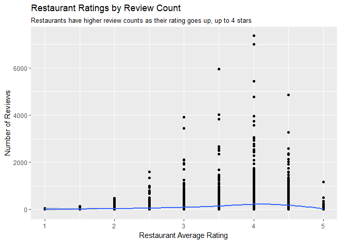

Restaurants with higher average ratings have higher review counts until
4 stars. After 4 stars, the number of reviews decreases as rating
increases. It could be that most users rate 3.5-4 stars and are less
hesitant to give a restaurant a 1, 2, or 5 star rating.

**q3.1** Create a vector called `top_15_categ` that includes the top 15
most common restaurant types in Las Vegas. What are the top 5 most
common types of restaurants in Las Vegas?

``` r
top_15_categ <-
  q2.1 %>%
  count(categories, sort = TRUE) %>%
  top_n(n = 15) %>%
  pull(categories)
```

    ## Selecting by n

``` r
top_15_categ[1:5]
```

    ## [1] "Mexican"                "Fast Food"             
    ## [3] "Pizza"                  "American (Traditional)"
    ## [5] "Coffee & Tea"

**q3.2** Using dataframe q2.1 and top\_15\_categ, create a visualization
that explores the rating distributions for each of the top 15
categories. You can either recreate [this
chart](https://imgur.com/a/ttpcdNh) or create a better one of your own\!

``` r
q2.1 %>%
  filter(categories %in% top_15_categ) %>%
  count(stars, categories) %>%
  ggplot(mapping = aes(x = stars, y = n, color = categories)) +
  geom_line() +
  labs(
    title = "Ratings by Restaurant Type",
    x = "Average Rating",
    y = "Number of Restaurants",
    color = "Restaurant Type",
    caption = "Source: Yelp"
  ) 
```

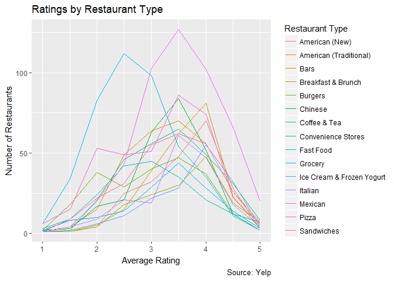

**q3.3** Create a visualization of your own to uncover a new insight
about restaurants in Las Vegas.

## Creating a Restaurant Map

Our Yelp data uses latitude and longitude to identify a business’s
location. We will use two R libraries, `ggmap` and `mapproj`, to create
our maps, as they use latitude and longitude data. You may want to move
the library calls below to the top of the R markdown file for style
purposes.

``` r
library(ggmap)
library(mapproj)
```

**q4.0** `ggmap` has pre-created maps that we can load and use. Create a
variable `lv_map` that is a map of Las Vegas (Hint: use `get_map()`,
specifying `location` as Las Vegas and `zoom` to get a good view). Use
`ggmap(lv_map)` to view the map you have created.

``` r
lv_map <- 
  get_map(
    location = 'Las Vegas',
    zoom = 12
  )
```

    ## Map from URL : http://maps.googleapis.com/maps/api/staticmap?center=Las+Vegas&zoom=12&size=640x640&scale=2&maptype=terrain&language=en-EN&sensor=false

    ## Information from URL : http://maps.googleapis.com/maps/api/geocode/json?address=Las%20Vegas&sensor=false

``` r
ggmap(lv_map)
```

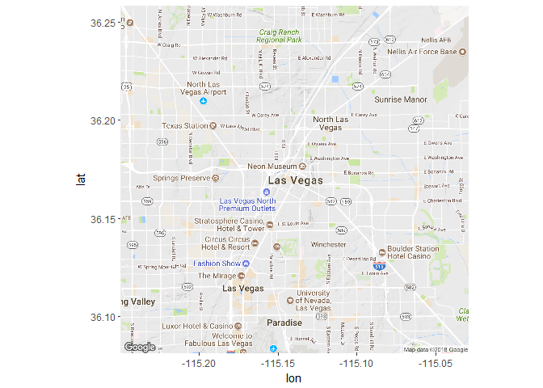

**q4.1** We can plot our restaurant data directly on the map of Las
Vegas by using `ggmap(lv_map) + geom_point(...)`. Create a dataframe
`q4.1` that only consists of Las Vegas “Burgers” restaurants. Plot the
points of `q4.1` over the map of Las Vegas, `lv_map`, to recreate [this
burger map](https://imgur.com/a/M8ua0cD).

``` r
q4.1 <-
  q2.1 %>%
  filter(categories == "Burgers")

map_output <-
  ggmap(lv_map) +
  geom_point(
    data = q4.1,
    aes(
      x = longitude,
      y = latitude,
      color = factor(format(round(stars, 1), nsmall = 1))
    ),
    alpha = 0.7
  ) +
  labs(
    title = "Burgers Food Map",
    x = NULL,
    y = NULL,
    caption = "Source: Yelp",
    color = "Business Rating"
  )

map_output
```

    ## Warning: Removed 74 rows containing missing values (geom_point).

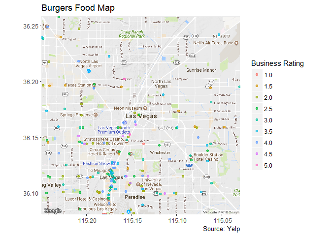

## Automating the Restaurant Map

We were able to create a map for Burgers, but suppose we want to create
this same restaurant map for each of the 15 most popular restaurant
types that we identified in `top_15_categ`.

**q5.0** First, create a function called `create_food_map` that inputs a
particular cuisine type (string) and returns the map we created above
but for this specific cuisine type (`print(image)` may be helpful to
return the image). Remember to update the map’s subtitle so that it is
customized for whatever cuisine type you are entering in (e.g.
“Category: Pizza”, “Category: Mexican”).

``` r
# Create function
create_food_map <- function(x) {
  # Filter dataset based on x cuisine
  df_cuisine <-
    q2.1 %>%
    filter(categories == x)
  
  # Create map
  map_output <-
    ggmap(lv_map) +
    geom_point(
      data = df_cuisine,
      aes(
        x = longitude,
        y = latitude,
        color = factor(format(round(stars, 1), nsmall = 1))
      ),
      alpha = 0.7
    ) +
    labs(
      title = "Las Vegas Restaurant Map",
      subtitle = str_c("Category: ", df_cuisine$categories),
      x = NULL,
      y = NULL,
      caption = "Source: Yelp",
      color = "Business Rating"
    )
  
  print(map_output)
}
```

**q5.1** Using the function you just created and `top_15_categ`, write
one line of code that will create a food map for each of the cuisine
types in `top_15_categ`. When you run this code, the output should be a
total of 15 restaurant maps, each customized for a specific cuisine
type.

``` r
walk(top_15_categ, create_food_map)
```

    ## Warning: Removed 155 rows containing missing values (geom_point).

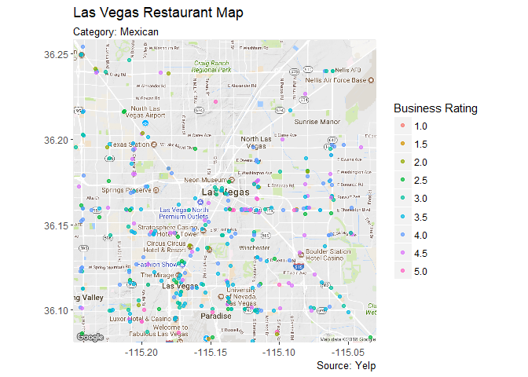

    ## Warning: Removed 162 rows containing missing values (geom_point).

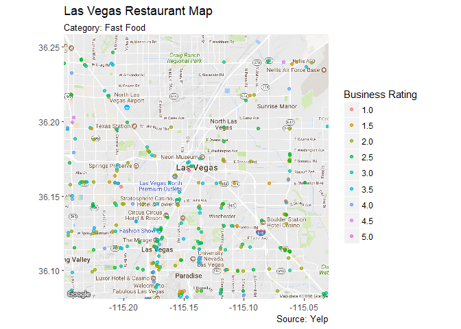

    ## Warning: Removed 155 rows containing missing values (geom_point).

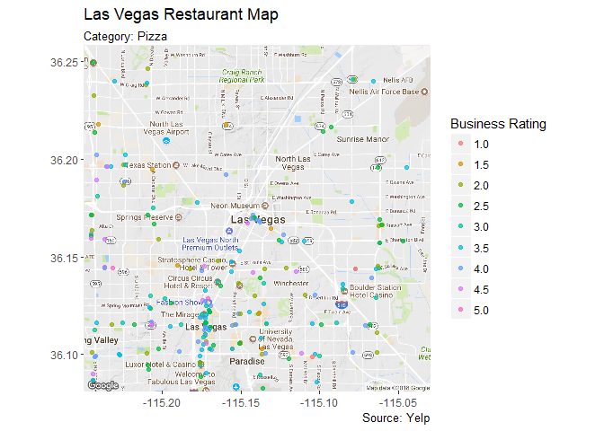

    ## Warning: Removed 102 rows containing missing values (geom_point).

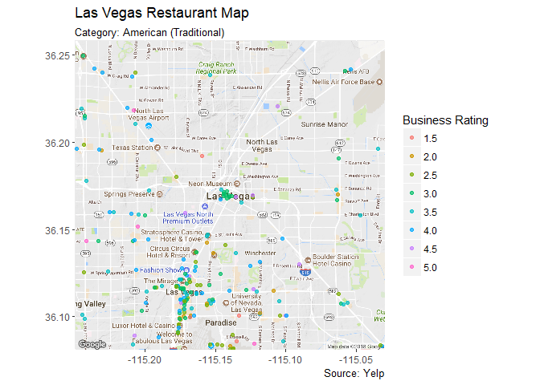

    ## Warning: Removed 111 rows containing missing values (geom_point).

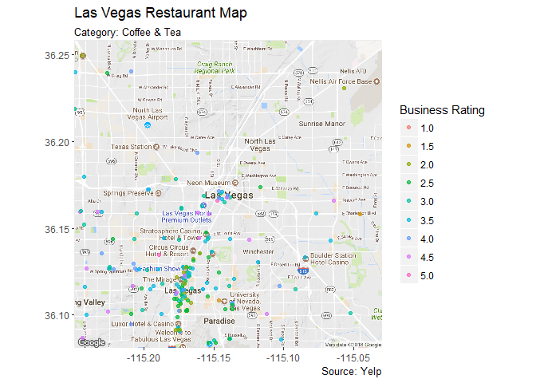

    ## Warning: Removed 103 rows containing missing values (geom_point).

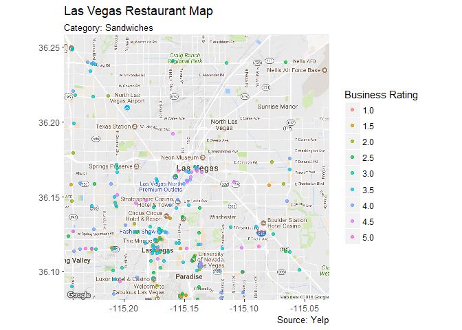

    ## Warning: Removed 71 rows containing missing values (geom_point).

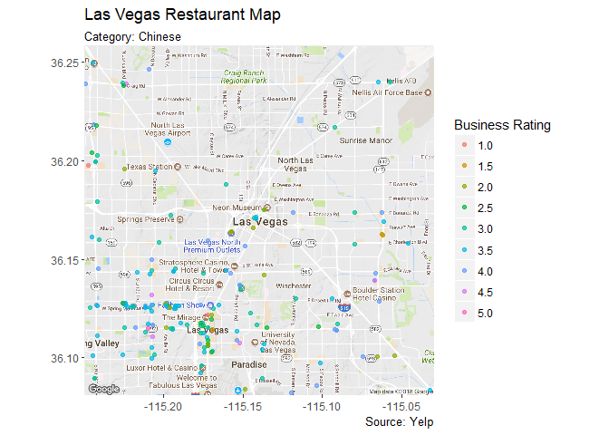

    ## Warning: Removed 69 rows containing missing values (geom_point).

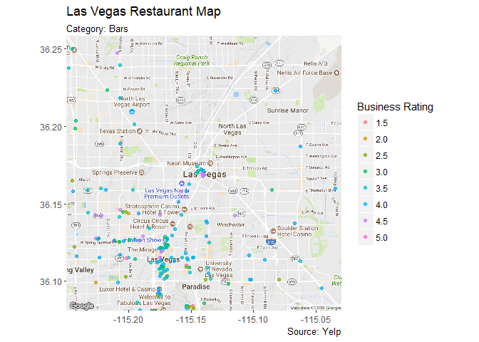

    ## Warning: Removed 74 rows containing missing values (geom_point).

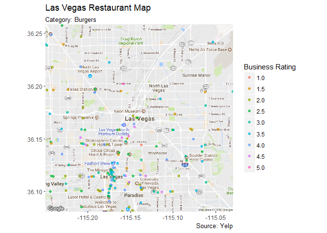

    ## Warning: Removed 69 rows containing missing values (geom_point).

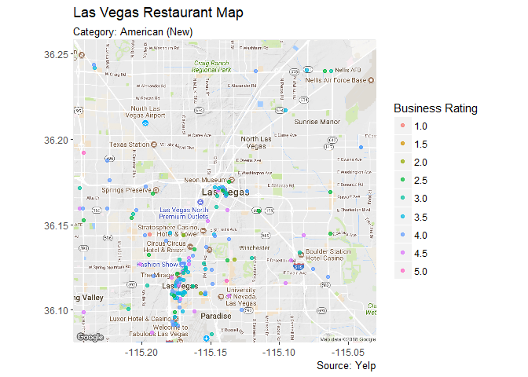

    ## Warning: Removed 105 rows containing missing values (geom_point).

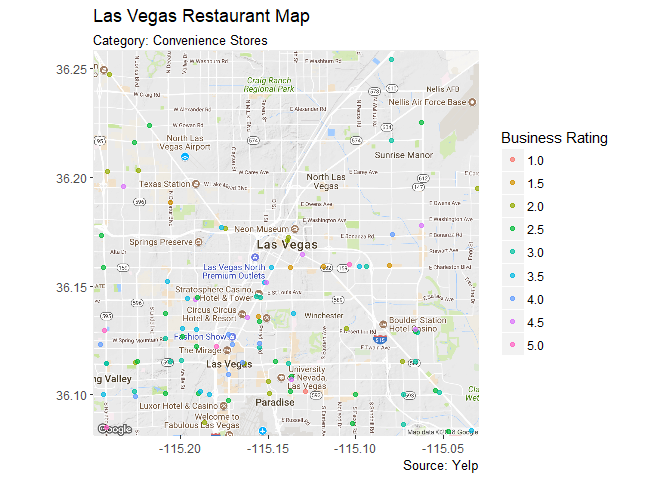

    ## Warning: Removed 70 rows containing missing values (geom_point).

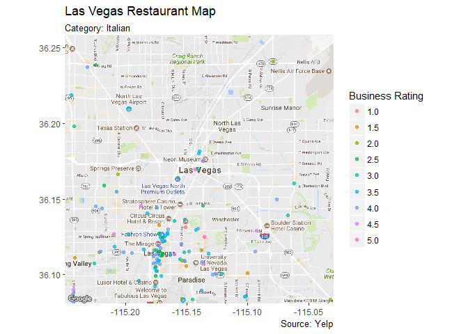

    ## Warning: Removed 73 rows containing missing values (geom_point).

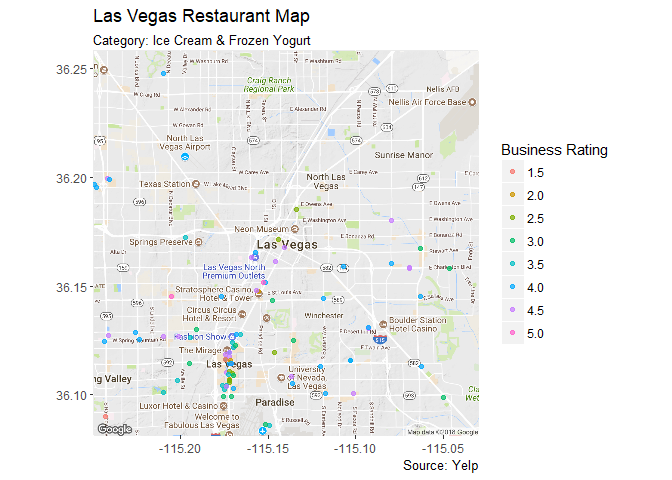

    ## Warning: Removed 57 rows containing missing values (geom_point).

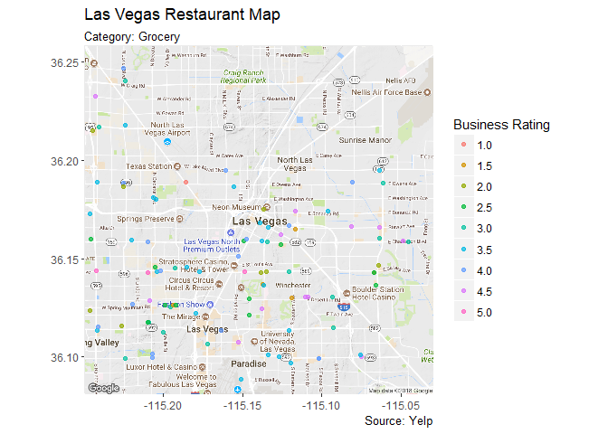

    ## Warning: Removed 65 rows containing missing values (geom_point).

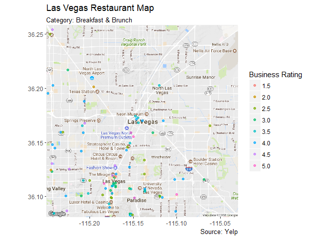
